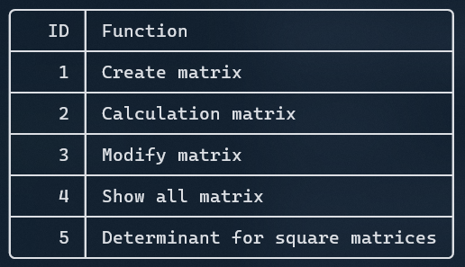
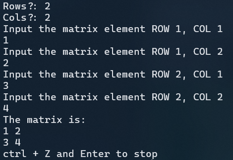

# MATRIX CALCULATOR

## Description

This program is written based on Python. Its can do matrix additional, subtitional,multiplicational, reverse and determinant of 2x2 3x3 matrix. Its also support alphabetical matrix element.

### Basics Usage

If you want to create a matrix, type 1,

Then, name the matrix

You can choose the dimensions for this matrix,

Finally, this promt user decide modify matrix, or create the new one.

### Basics rules

- Rule 1: You only need to type the alphabetical for name the matrix from A to Z( I don't think you need alot matrix than this. )
- Rule 2: You can only type the equation for the matrix for eg: A + C or A*C or reverse(A)*C

That's it, its very simple
